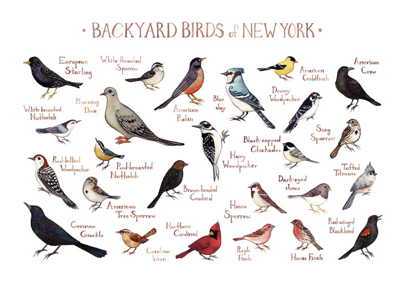

# Birds of NY

### *Getting MEAN on a Wing and a Prayer*

You've just started your first day at the well-regarded dev agency 
[Professionalnobodies.biz](http://professionalnobodies.biz).

Sadly, your senior developer left in a hurry to work on the Bernie Sanders 
campaign, leaving you as the sole developer on a new "bird finder" app
called [**Birdwatchr**](http://github.com/phlco/birdwatchr).

## No need to grouse…

"*She said she was just about to Genghis-Khan something or other*," says 
the 53-year-old office intern, forlornly reading a Post-It note.

She hands you the crumpled note with the following tasks:

- [x] resignation letter
- [ ] implement mongodb
- [ ] when a user visits `/sightings/new` show a form to add a bird's name
- [ ] expose an API. when a user visits `api/sightings` render all the sightings as JSON

## Where do we flamingo from here?

The next day you run into your project manager by the photocopier. "*Nice work, but
I want to see the 3 most recent sightings on the index page and include the location.
I think it'll really set us apart in the bird watching biz*," she says, printing
out her resume.

You scribble down onto a Post-It note:

- [ ] store date information
- [ ] show last 3 sightings on index
- [ ] add address location to form

## Cockatoo where are you?

As you pass the UX designer hunched over the fax machine she asks if you know the
zip code for Vermont.  "If only it was as easy to look up as it is to geocode addresses
with the [NPM package geocoder](https://www.npmjs.com/package/geocoder)," she chuckles.

You jot down the following onto a Post-It note:

- [ ] geocode locations and store their lat/long?
- [ ] figure out UX designer's name
- [ ] find out: does Vermont only have one zip code?

## Toucan do it!

The CEO calls you into her office, mutes the TED Talk she's watching and says:

"*You know, I've heard a ton about this Ajax thing. I want you to
put together a demo page that I can show to our shareholders. I'll tell them to
go to the demo page and click on a link and see all of our bird data. And 
then I want them to type in an address and send back the lat/long all with Ajax.*"

- [x] create `/demo` page
- [ ] "ajax" the bird data and render it
- [ ] "ajax" a location and geocode it

## Sparrow me.

"*People make mistakes!*" you hear the receptionist sobbing into the phone. This
gets you thinking, "*Maybe we should be able to edit and update bird sightings!*"

- [ ] add edit functionality
- [ ] get receptionist a tissue
- [ ] plan exit

## A cheep date?

You've scored a data via [Coffee meets Bagel](https://coffeemeetsbagel.com/) with
"WebBoi87."

"*His name is Jacob and it says he's a dev too. Look at this online portfolio!*" 
you say to your roommate.

Your roommate responds, "*Didn't you find some [notes on deployment](notes.md)?
Maybe you should get your bird app deployed so you have something to talk about.*"

"*Good idea, mom.*"

- [ ] go over deployment notes
- [ ] deploy app to heroku
- [ ] get own apartment

## Owl never fall in love again…

On your second Coffee meets Bagel date with Jacob, you #humblebrag about your sweet
new job as a developer.

"*This text looks kind of small, did you set a 
[view port](https://developer.mozilla.org/en-US/docs/Mozilla/Mobile/Viewport_meta_tag)?*"
Jacob says, peering up from behind his Nokia Lumia. "*Also, your profile said 
you were 5'7"…*"

You cough up into your riesling and mutter, "*They must not have deployed my changes.*"

You scribble onto your hand:

- [ ] don't date devs
- [ ] add a viewport

## Goose your own way!

At your project manager's going away party you make small talk with the still
anonymous UX designer. "*Have you read this blog post on GeoSpatial queries? What if
we could show bird sightings by proximity to the user?? Gimme that Post-It!*"

She scribbles down the following:

- [ ] [Get a user's location](https://developer.mozilla.org/en-US/docs/Web/API/Geolocation/Using_geolocation) and [query db for locations](http://tugdualgrall.blogspot.com/2014/08/introduction-to-mongodb-geospatial.html)
- [ ] make more eye contact !!!!!!!!
